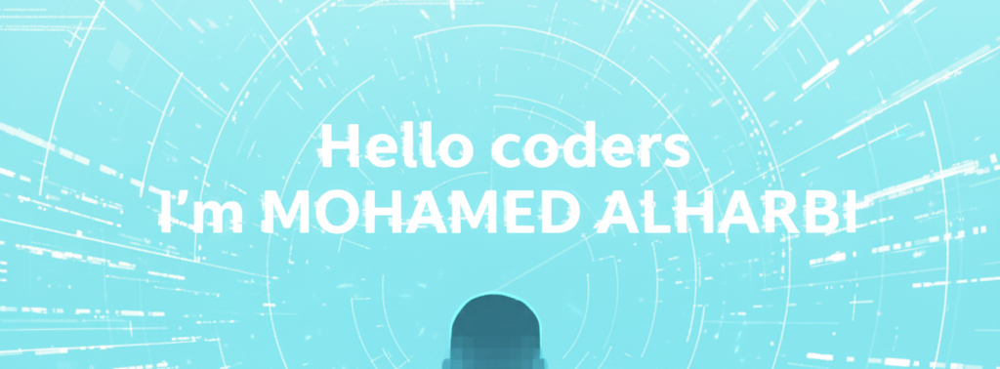

# 👋 Hi, I'm **Mohammed Alharbi**
### 💻 Web Developer | .NET & Front-End

Building clean, modern, and scalable web applications.

---

## 🚀 About Me
I’m a recent Computer Information Systems graduate passionate about building modern, efficient web applications. I enjoy working on web development, and I’m always looking to improve my skills and learn new technologies.
Alongside web development, I also have a strong interest in data analysis and UI/UX design, as I enjoy turning data into meaningful insights and creating user-friendly, intuitive interfaces.
I’m motivated, detail-oriented, and always eager to take on challenges that help me grow as a developer.

---

## 🛠️ Technologies & Tools

### **Back-End & Database**
<table>
<tr>
<td> C#</td>
<td> ASP.NET Core</td>
<td> SQL Server</td>
</tr>
</table>

---

### **Front-End**
<table>
<tr>
<td> HTML</td>
<td> CSS</td>
<td> JavaScript</td>
<td> Tailwind CSS</td>
<td> React (Basics)</td>
</tr>
</table>

---

### **Other Skills**
<table>
 <tr>
<td></td>
<td></td>
<td></td>
<td></td>
  </tr>
</table>

---

## 📂 Projects  

*(Coming soon…)*  
I will be uploading my current projects shortly. Stay tuned 👀

---

## 🤝 Connect With Me
- **LinkedIn:** [Mohammed Alharbi](https://linkedin.com/in/mohamed23alharbi)  
- **Email:** MH.ALHARBI03@gmail.com  

