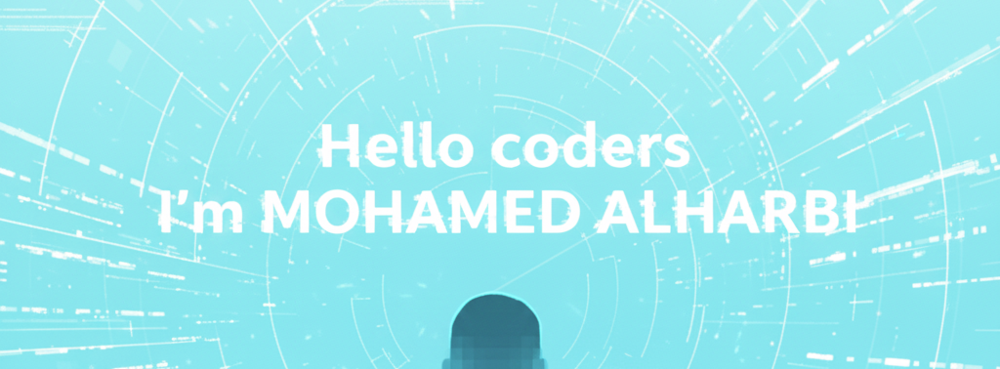

# 👋 Hi, I'm **Mohammed Alharbi**

### 💻 Web Developer | .NET & Front-End

Building clean, modern, and scalable web applications.

---

## 🚀 About Me

I’m a Computer Information Systems graduate passionate about building modern and efficient web applications.

I have experience in web development, system analysis, UI/UX design, and database integration. I enjoy transforming ideas and requirements into practical digital solutions with a focus on usability and performance.

I’m continuously improving my technical skills and exploring new technologies to create better software solutions.

---

## 🛠️ Technologies & Tools

### **Back-End & Database**

<table>
<tr>
<td>

 C#
</td>

<td>

 ASP.NET Core
</td>

<td>

 SQL Server
</td>

</tr>
</table>

---

### **Front-End**

<table>
<tr>

<td>

 HTML
</td>

<td>

 CSS
</td>

<td>

 JavaScript
</td>

<td>

 Tailwind CSS
</td>

<td>

 React
</td>

</tr>
</table>

---

### **Tools & Other Skills**

<table>

<tr>

<td>

</td>

<td>

</td>

<td>

</td>

<td>

</td>

</tr>

</table>

---

## 📂 Featured Projects

### 🔹 Nuzum
**Administrative Communication Management System**

A web-based administrative communication system developed for Maskani Association to improve internal workflows and digital transformation.

**My Contributions:**
- Requirements Gathering & System Analysis
- UI/UX Design
- Front-End & Back-End Development
- Database Design & Integration

**Technologies:**
ASP.NET Core MVC • C# • SQL Server • HTML/CSS/JS • Tailwind CSS

---

## 🤝 Connect With Me

- **LinkedIn:** [Mohammed Alharbi](https://linkedin.com/in/mohamed23alharbi)

- **Email:** MohamedHAlharbi23@gmail.com

- **Portfolio** https://mohamed-protfoilo.netlify.app/
